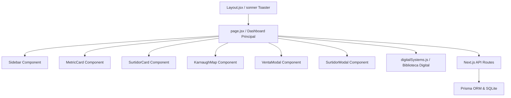

# Documentación del Diseño Digital y de Software
## Estación de Servicio "El Surtidor Cochabambino"

Esta documentación detalla los fundamentos de **Sistemas Digitales (SD)** y de **Ingeniería de Software** aplicados en el proyecto final.

---

## 1. Diseño Lógico de Sensores de Nivel (S1, S0)

El nivel de almacenamiento del combustible en cada surtidor se monitoriza digitalmente utilizando **dos sensores binarios ($S_1, S_0$)**, capaces de representar 4 estados lógicos ($2^2 = 4$).

### Tabla de Verdad de Niveles y LEDs

| Entrada ($S_1$) | Entrada ($S_0$) | Porcentaje de Nivel | Estado / LED Activo | Mintermino |
| :---: | :---: | :---: | :---: | :---: |
| 0 | 0 | 0% - 25% | **Crítico / LED Rojo** | $m_0$ |
| 0 | 1 | 25% - 50% | **Bajo / LED Amarillo** | $m_1$ |
| 1 | 0 | 50% - 75% | **Normal-Medio / LED Verde** | $m_2$ |
| 1 | 1 | 75% - 100% | **Normal-Lleno / LED Verde** | $m_3$ |

---

## 2. Simplificación y Mapas de Karnaugh

Para controlar la activación de las alertas físicas (LEDs) se diseñaron circuitos lógicos combinacionales utilizando minitérminos.

### A. LED Rojo ($F_{rojo}$ - Nivel Crítico)

Se activa únicamente cuando el tanque está críticamente bajo ($00$):
* Minterminos activos: $m_0 = \bar{S_1} \cdot \bar{S_0}$

**Mapa de Karnaugh:**
```
      S0
S1 \  0   1
   +---+---+
 0 | 1 | 0 |  <- m0 activo (1)
   +---+---+
 1 | 0 | 0 |
   +---+---+
```
* **Expresión Lógica**: $F_{rojo} = \bar{S_1} \cdot \bar{S_0}$
* **Compuerta Lógica**: Una compuerta **NOR** $(\overline{S_1 + S_0})$.

---

### B. LED Amarillo ($F_{amarillo}$ - Nivel Bajo)

Se activa únicamente cuando el nivel está entre el 25% y 50% ($01$):
* Minterminos activos: $m_1 = \bar{S_1} \cdot S_0$

**Mapa de Karnaugh:**
```
      S0
S1 \  0   1
   +---+---+
 0 | 0 | 1 |  <- m1 activo (1)
   +---+---+
 1 | 0 | 0 |
   +---+---+
```
* **Expresión Lógica**: $F_{amarillo} = \bar{S_1} \cdot S_0$
* **Compuerta Lógica**: Una compuerta **AND** con entrada $S_1$ negada $(\text{NOT}(S_1) \text{ AND } S_0)$.

---

### C. LED Verde ($F_{verde}$ - Nivel Normal/Lleno)

Se activa si el tanque está en niveles óptimos ($10$ o $11$):
* Minterminos activos: $m_2 + m_3 = (S_1 \cdot \bar{S_0}) + (S_1 \cdot S_0)$

**Simplificación por Álgebra de Boole:**
$$F_{verde} = S_1 \cdot (\bar{S_0} + S_0)$$
Como $\bar{S_0} + S_0 = 1$ (Ley del complemento):
$$F_{verde} = S_1 \cdot 1 = S_1$$

* **Expresión Lógica**: $F_{verde} = S_1$
* **Compuerta Lógica**: Conexión directa del bit más significativo ($S_1$ en estado alto).

---

## 3. Decodificador de Combustibles (2 bits)

Se utiliza un decodificador de 2 bits para asignar los combustibles disponibles basándose en una codificación lógica en base de datos:

| Código Binario | Línea Activa | Combustible Asignado | Precio Oficial |
| :---: | :---: | :---: | :---: |
| `00` | $D_0$ | Gasolina Especial | Bs. 3.74 |
| `01` | $D_1$ | Diesel Oil | Bs. 3.72 |
| `10` | $D_2$ | Gasolina Premium Ultra | Bs. 4.79 |
| `11` | $D_3$ | GNV Vehicular | Bs. 1.66 / m³ |

---

## 4. Aritmética Binaria para Cálculo de Ventas

El sistema realiza el cálculo del importe en base decimal:
$$\text{Total (Bs.)} = \text{Litros} \times \text{Precio por Litro}$$

Posteriormente, implementa un algoritmo de **Conversión a Coma Fija Binaria** para simular un procesador digital (dentro de `digitalSystems.js`):
1. **Parte Entera**: Conversión mediante divisiones sucesivas entre 2.
2. **Parte Fraccionaria**: Conversión mediante multiplicaciones sucesivas por 2 (precisión de 6 bits de resolución).

*Ejemplo:*
* Total: Bs. $15.50$
* Parte Entera: $15_{10} = 1111_2$
* Parte Fraccionaria: $0.5_{10} \times 2 = 1.0 \rightarrow 1_2$
* Resultado binario final: $1111.1_2$

---

## 5. Arquitectura de Software

El proyecto se estructuró con un diseño modular y desacoplado:



### Componentes Creados:
- **`Sidebar.jsx`**: Panel de navegación y control de comandos de voz mediante Web Speech API.
- **`SurtidorCard.jsx`**: Representación gráfica de cada tanque con lógica visual asociada al nivel.
- **`KarnaughMap.jsx`**: Renderización del mapa 2x2.
- **`VentaModal.jsx` / `SurtidorModal.jsx`**: Diálogos con validaciones locales y previsualizaciones en código binario en tiempo real.
- **`MetricCard.jsx`**: Componente de indicadores estadísticos (KPIs).
