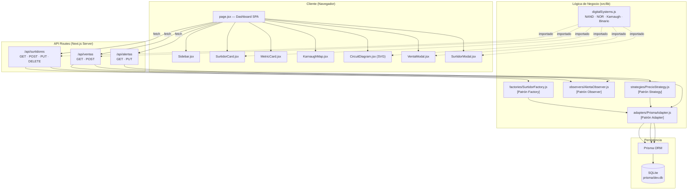
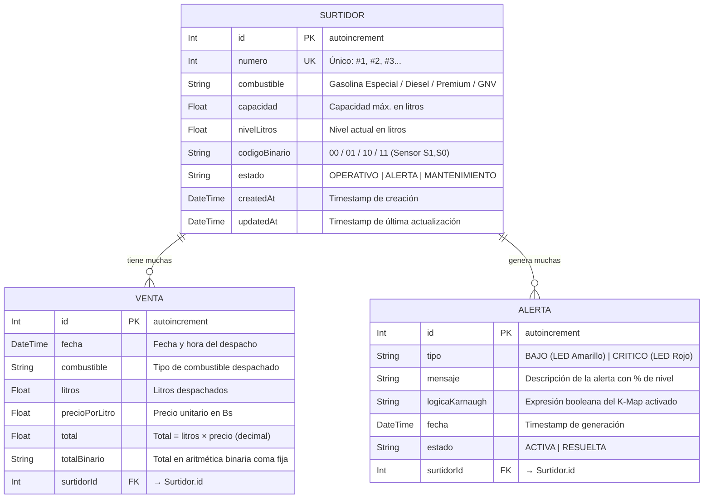
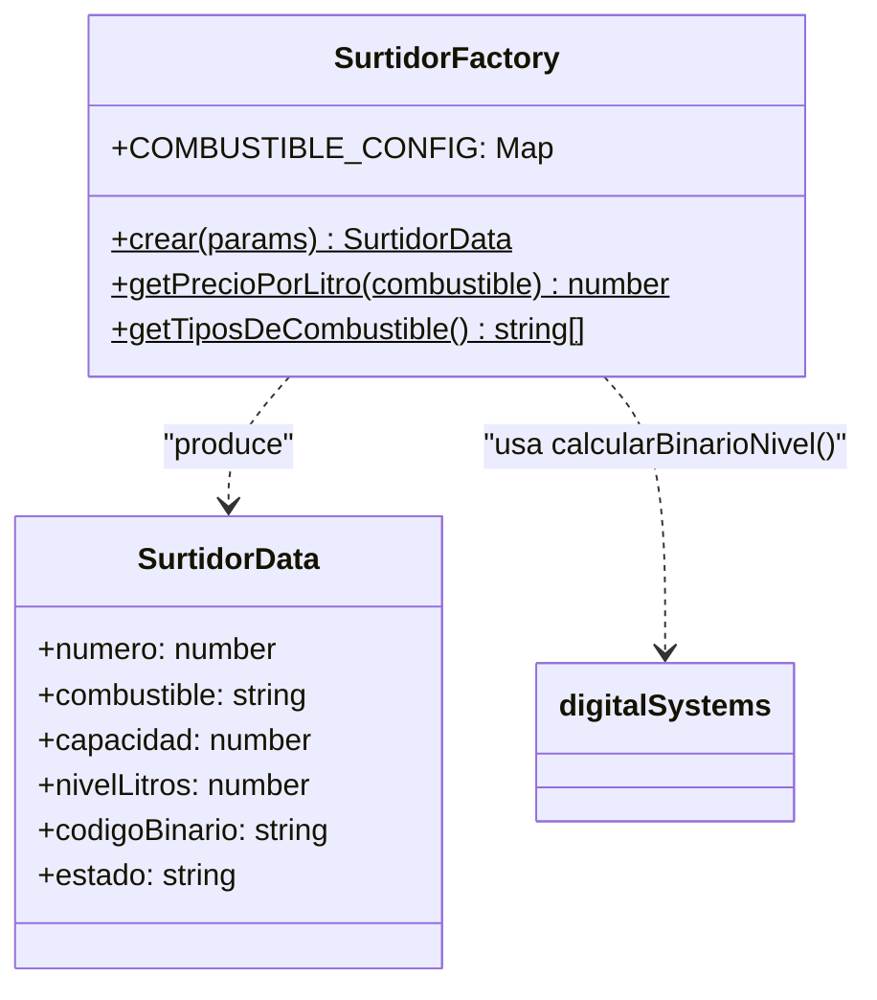
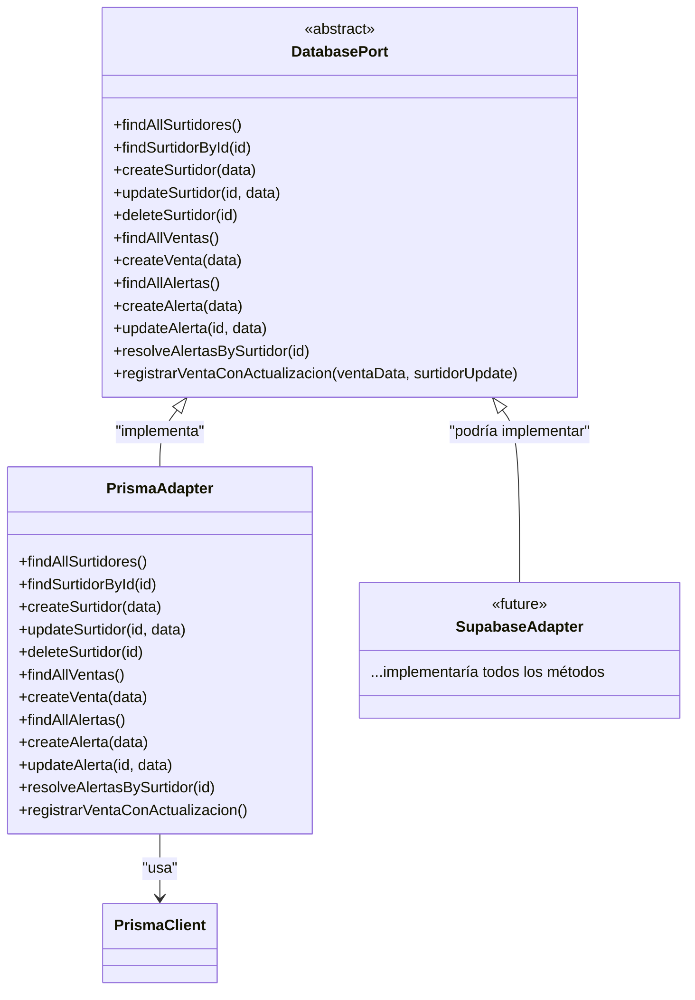
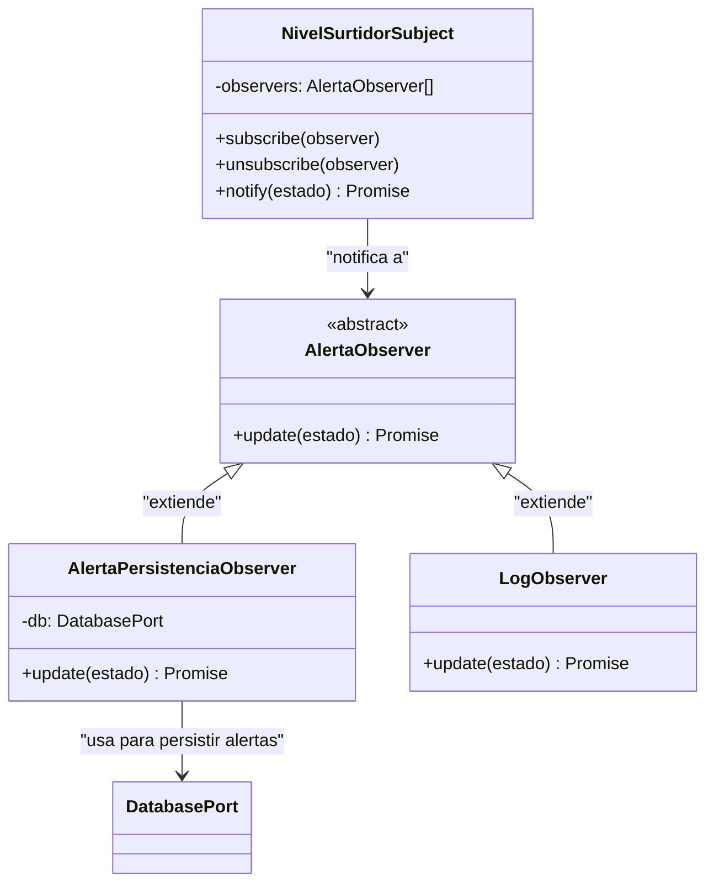
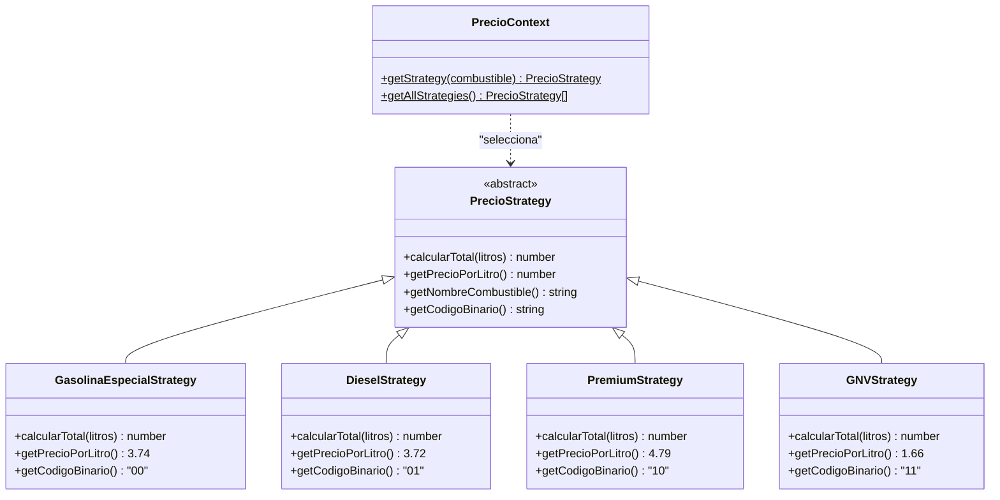
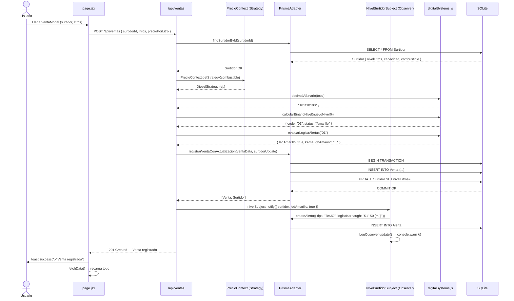

# 📚 Documentación Técnica Completa
## El Surtidor Cochabambino — Sistema Digital de Gestión
### Proyecto Final · Programación 4 · Universidad

> **Stack:** Next.js 14 · Prisma ORM · SQLite · Vitest · Vercel
> **GitHub:** `Angel-gg/proyecto-final-progra-4`

---

## 📋 Índice

1. [Descripción General](#1-descripción-general)
2. [Arquitectura del Sistema](#2-arquitectura-del-sistema)
3. [Diagrama Entidad–Relación (ER)](#3-diagrama-entidadrelación-er)
4. [Diagrama de Clases — Patrones de Diseño](#4-diagrama-de-clases--patrones-de-diseño)
5. [Sistemas Digitales — Lógica de Compuertas](#5-sistemas-digitales--lógica-de-compuertas)
6. [Flujo de Datos — Registro de Venta](#6-flujo-de-datos--registro-de-venta)
7. [Estructura de Archivos del Proyecto](#7-estructura-de-archivos-del-proyecto)
8. [API Reference](#8-api-reference)
9. [Guía de Ejecución Local](#9-guía-de-ejecución-local)
10. [Deploy en Vercel](#10-deploy-en-vercel)

---

## 1. Descripción General

El sistema gestiona una estación de servicio mediante lógica digital integrada en software. Cada surtidor expone sensores de nivel representados en binario (2 bits), y el sistema aplica mapas de Karnaugh para determinar el estado de los LEDs de alerta.

### Módulos del Sistema

| Módulo | Funcionalidad | Concepto SD aplicado |
|---|---|---|
| **Surtidores** | CRUD: registrar, listar, editar, eliminar | Sensor de nivel 2 bits (S1, S0) |
| **Ventas** | Registrar despacho de combustible | Aritmética binaria en totales |
| **Alertas** | Monitoreo de nivel bajo/crítico | Compuertas NOR/NAND — Karnaugh |
| **Reportes** | Ventas diarias, inventario por combustible | Decodificador 2 bits de combustible |

---

## 2. Arquitectura del Sistema



---

## 3. Diagrama Entidad–Relación (ER)



### Restricciones de integridad
- **Cascade Delete**: Al eliminar un `Surtidor`, se eliminan en cascada todas sus `Venta` y `Alerta`.
- **Unique**: `Surtidor.numero` es único — no pueden existir dos surtidores con el mismo número.
- **Computed fields**: `codigoBinario` y `estado` son calculados por la `SurtidorFactory` a partir de `nivelLitros / capacidad`.

---

## 4. Diagrama de Clases — Patrones de Diseño

### 4.1 Patrón Creacional — Factory



### 4.2 Patrón Estructural — Adapter



### 4.3 Patrón de Comportamiento — Observer



### 4.4 Patrón de Comportamiento — Strategy



---

## 5. Sistemas Digitales — Lógica de Compuertas

### 5.1 Tabla de Verdad Completa

| S1 | S0 | Nivel | LED | Mintermino | Expresión K-Map |
|:---:|:---:|:---:|:---:|:---:|:---|
| 0 | 0 | 0–25% | 🔴 Rojo | m₀ | F = NAND(NAND(S1,S1), NAND(S0,S0)) = S1'·S0' |
| 0 | 1 | 25–50% | 🟡 Amarillo | m₁ | F = AND(NOT S1, S0) = S1'·S0 |
| 1 | 0 | 50–75% | 🟢 Verde | m₂ | F = S1 (activo) |
| 1 | 1 | 75–100% | 🟢 Verde | m₃ | F = S1 (activo) |

### 5.2 Mapas de Karnaugh

**LED Rojo (m₀) — Compuerta NOR / NAND Universal:**
```
      S0
S1 \   0    1
    +----+----+
 0  |  1 |  0 |  ← m₀ activo
    +----+----+
 1  |  0 |  0 |
    +----+----+

F_rojo = S1'·S0' = NOR(S1, S0)
Implementación NAND universal: NAND(NAND(S1,S1), NAND(S0,S0))
  ↳ NAND(x,x) = NOT(x)   [NAND como inversor]
  ↳ AND(NOT S1, NOT S0) = S1'·S0' ✓
```

**LED Amarillo (m₁) — Compuerta AND + NOT:**
```
      S0
S1 \   0    1
    +----+----+
 0  |  0 |  1 |  ← m₁ activo
    +----+----+
 1  |  0 |  0 |
    +----+----+

F_amarillo = S1'·S0 = AND(NOT S1, S0)
```

**LED Verde (m₂ + m₃) — Simplificación Booleana:**
```
F_verde = S1·S0' + S1·S0 = S1·(S0' + S0) = S1·1 = S1

El bit más significativo S1=1 activa directamente el LED Verde.
```

### 5.3 Tabla de Compuertas Implementadas en Código

| Función | Código JS | Descripción |
|---|---|---|
| `AND(a, b)` | `a && b` | Salida 1 solo si a=1 y b=1 |
| `OR(a, b)` | `a \|\| b` | Salida 1 si al menos una entrada es 1 |
| `NOT(a)` | `!a` | Inversión lógica |
| `NAND(a, b)` | `!(a && b)` | NOT-AND — compuerta universal |
| `NOR(a, b)` | `!(a \|\| b)` | NOT-OR — compuerta universal |
| `XNOR(a, b)` | `a === b` | Equivalencia lógica |

### 5.4 Aritmética Binaria — Algoritmo de Conversión

```
Entrada: número decimal (ej: 149.6)

1. Parte entera: 149 → toString(2) → "10010101"
2. Parte fraccionaria (multiplicaciones sucesivas por 2, máx 6 bits):
   0.6 × 2 = 1.2  → bit: 1, resto: 0.2
   0.2 × 2 = 0.4  → bit: 0, resto: 0.4
   0.4 × 2 = 0.8  → bit: 0, resto: 0.8
   0.8 × 2 = 1.6  → bit: 1, resto: 0.6
   0.6 × 2 = 1.2  → bit: 1, resto: 0.2
   0.2 × 2 = 0.4  → bit: 0, resto: 0.4

Resultado: "10010101.100110" ₂
```

### 5.5 Decodificador de Combustibles (2 bits)

| Código (C1,C0) | Línea activa | Combustible | Precio (Bs/L) |
|:---:|:---:|:---|:---:|
| 00 | D₀ | Gasolina Especial | 3.74 |
| 01 | D₁ | Diesel Oil | 3.72 |
| 10 | D₂ | Gasolina Premium Ultra | 4.79 |
| 11 | D₃ | GNV Vehicular | 1.66/m³ |

---

## 6. Flujo de Datos — Registro de Venta



---

## 7. Estructura de Archivos del Proyecto

```
proyecto-final-progra-4/
├── 📄 README.md                    # Documentación principal (GitHub)
├── 📄 DOCUMENTACION_DISEÑO.md      # Diseño de sistemas digitales original
├── 📄 DOCUMENTACION_TECNICA.md     # Esta documentación completa ← NUEVO
├── 📄 package.json                 # Scripts y dependencias
├── 📄 vercel.json                  # Configuración de deploy Vercel
├── 📄 sonar-project.properties     # Configuración SonarQube
├── 📄 vitest.config.js             # Configuración de tests
├── 📄 .env.example                 # Plantilla de variables de entorno
│
├── 📁 prisma/
│   ├── schema.prisma               # Esquema de BD (Surtidor, Venta, Alerta)
│   ├── seed.js                     # Datos iniciales de demostración
│   └── dev.db                      # Base de datos SQLite (incluida en repo)
│
├── 📁 __tests__/
│   ├── digitalSystems.test.js      # 47 tests — SD, NAND, Karnaugh, Binario
│   ├── SurtidorFactory.test.js     # 12 tests — Patrón Factory
│   ├── AlertaObserver.test.js      #  8 tests — Patrón Observer
│   └── PrecioStrategy.test.js      # 20 tests — Patrón Strategy
│
└── 📁 src/
    ├── 📁 app/
    │   ├── layout.jsx              # Layout raíz (Toaster, metadata)
    │   ├── page.jsx                # Página principal — Dashboard SPA (655+ líneas)
    │   ├── globals.css             # Sistema de diseño — Dark theme
    │   └── 📁 api/
    │       ├── surtidores/route.js # API REST — CRUD surtidores
    │       ├── ventas/route.js     # API REST — Registro de ventas
    │       └── alertas/route.js    # API REST — Gestión de alertas
    │
    ├── 📁 components/
    │   ├── Sidebar.jsx             # Navegación + Web Speech API
    │   ├── MetricCard.jsx          # KPI card (Dashboard)
    │   ├── SurtidorCard.jsx        # Tarjeta de surtidor con barra de nivel
    │   ├── KarnaughMap.jsx         # Mapa K 2×2 interactivo
    │   ├── CircuitDiagram.jsx      # Circuito SVG animado NAND/NOR
    │   ├── VentaModal.jsx          # Modal de nueva venta + preview binario
    │   └── SurtidorModal.jsx       # Modal crear/editar surtidor
    │
    └── 📁 lib/
        ├── prisma.js               # Singleton de PrismaClient
        ├── digitalSystems.js       # Core SD: NAND, NOR, Karnaugh, Binario
        ├── 📁 adapters/
        │   ├── DatabaseAdapter.js  # Interfaz abstracta (Port)
        │   └── PrismaAdapter.js    # Implementación Prisma (Adapter)
        ├── 📁 factories/
        │   └── SurtidorFactory.js  # Patrón Factory — Creación de surtidores
        ├── 📁 observers/
        │   └── AlertaObserver.js   # Patrón Observer — Sistema de alertas
        └── 📁 strategies/
            └── PrecioStrategy.js   # Patrón Strategy — Cálculo de precios
```

---

## 8. API Reference

### GET /api/surtidores
Retorna todos los surtidores con sus alertas activas incluidas.

**Response 200:**
```json
[
  {
    "id": 1,
    "numero": 1,
    "combustible": "Gasolina Especial (Bs 3.74/L)",
    "capacidad": 10000,
    "nivelLitros": 8500,
    "codigoBinario": "11",
    "estado": "OPERATIVO",
    "alertas": []
  }
]
```

### POST /api/surtidores
Crea un nuevo surtidor. La Factory valida y calcula el código binario.

**Body:**
```json
{
  "numero": 5,
  "combustible": "Diesel Oil",
  "capacidad": 12000,
  "nivelLitros": 3000
}
```
**Response 201:** Surtidor creado con `codigoBinario: "00"` y `estado: "ALERTA"` (porque 3000/12000 = 25%).

### POST /api/ventas
Registra una venta, descuenta litros del surtidor y genera alertas si el nivel cae.

**Body:**
```json
{
  "surtidorId": 1,
  "litros": 40,
  "precioPorLitro": 3.74
}
```

**Response 201:**
```json
{
  "id": 4,
  "fecha": "2026-07-24T12:30:00.000Z",
  "combustible": "Gasolina Especial (Bs 3.74/L)",
  "litros": 40,
  "precioPorLitro": 3.74,
  "total": 149.6,
  "totalBinario": "10010101.100110",
  "surtidorId": 1
}
```

### PUT /api/alertas
Marca una alerta como RESUELTA.

**Body:**
```json
{ "id": 2, "estado": "RESUELTA" }
```

---

## 9. Guía de Ejecución Local

### Prerequisitos
- Node.js ≥ 18
- npm ≥ 9

### Pasos

```bash
# 1. Clonar el repositorio
git clone https://github.com/Angel-gg/proyecto-final-progra-4.git
cd proyecto-final-progra-4

# 2. Crear archivo de variables de entorno
copy .env.example .env

# 3. Instalar dependencias
npm install

# 4. Inicializar BD y cargar datos demo
npm run db:reset

# 5. Iniciar servidor de desarrollo
npm run dev
```

Abrir: **http://localhost:3000**

### Comandos útiles

```bash
npm test                 # 87 tests unitarios
npm run test:coverage    # Reporte de cobertura HTML
npm run db:studio        # Prisma Studio (visual BD)
npm run lint             # ESLint
```

---

## 10. Deploy en Vercel

### Proceso automático

```
GitHub Push → Vercel detecta → Build → Deploy
```

### Build command (en vercel.json / package.json)

```bash
prisma generate && prisma db push --force-reset && node prisma/seed.js && next build
```

Esto garantiza que en cada deploy:
1. ✅ Se generan los clientes de Prisma
2. ✅ Se crea la BD SQLite con el esquema correcto
3. ✅ Se cargan los 4 surtidores + ventas + alertas de demostración
4. ✅ Next.js compila en modo producción

### Variables de entorno en Vercel

En **Vercel Dashboard → Project Settings → Environment Variables**:

| Variable | Valor |
|---|---|
| `DATABASE_URL` | `file:./dev.db` |

### URL de producción

Disponible en: `https://proyecto-final-progra-4.vercel.app`
(o la URL asignada por Vercel al conectar el repositorio)

---

## 11. Resumen de Calidad — Tests

| Suite | Tests | Estado |
|---|---|---|
| `digitalSystems.test.js` | 47 | ✅ PASS |
| `SurtidorFactory.test.js` | 12 | ✅ PASS |
| `AlertaObserver.test.js` | 8 | ✅ PASS |
| `PrecioStrategy.test.js` | 20 | ✅ PASS |
| **TOTAL** | **87** | **✅ 87/87 PASS** |

### SonarQube

Configurado en `sonar-project.properties`:
- Fuentes: `src/`
- Tests: `__tests__/`
- Exclusiones: `.next/`, `node_modules/`, `prisma/`
- Cobertura: `coverage/lcov.info`

---

*Desarrollado con ❤️ en Cochabamba, Bolivia 🇧🇴*
*Universidad — Proyecto Final de Programación 4*
